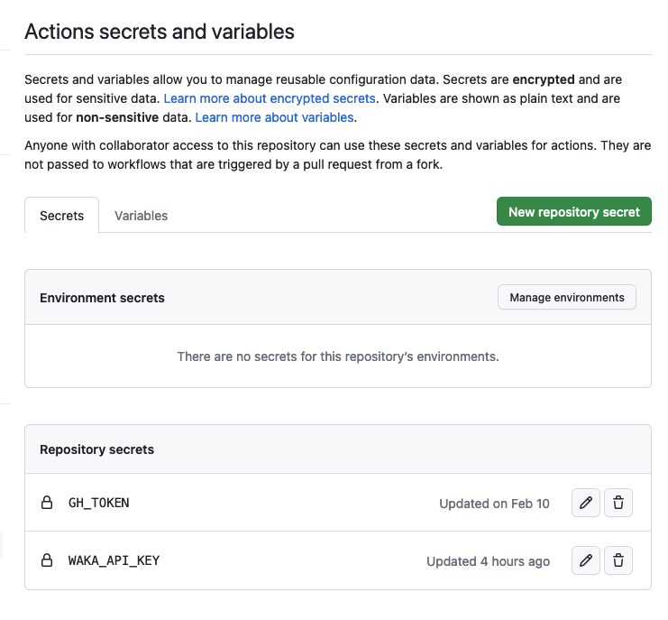

# WakaHS - Update GitHub Profile


## ⭐️ An Awesome GitHub Profile Renderer

This is a Haskell version of [anmol098/waka-readme-stats](https://github.com/anmol098/waka-readme-stats) with better robustness and well-structured code.

## 🌰 Examples 

**TBD**


## ✅ Pre-requisites

1. **Prepare a GitHub Access Token**, go to your `Github settings`, click `Developer settings`, click `Personal access tokens`, click `Generate new token`, choose the `classic` one. Here is the link [https://github.com/settings/tokens](https://github.com/settings/tokens). Currently, the token should have the following scopes:
    - `repo`
    - `user`

2. **Get a Wakatime Token**, create a account on [https://wakatime.com/](https://wakatime.com/), go to the `Settings` page on the top-right of the webpage, click `API Key`, click `Generate API Key`. Or you can just visit this link [https://wakatime.com/settings/api-key](https://wakatime.com/settings/api-key).


3. **Put these two keys into the repo secrets**, go to your settings of your profile repo, in general, the name should be the same as your id. Go to the `Secrets and variables` on the left column of the page, select the `Actions` tab, then click green `New repository secret` button on the right.

The well configured repo secrets should look like this:



## 📝 Usage

You will need to create a `template.md` file in the root of your profile repo, and then create a `README.md` file in the root of your profile repo, and then create a `waka.yml` file in the `.github/workflows` folder of your profile repo. The `template.md` file is the template of your `README.md` file, and the `waka.yml` file is the configuration file of the GitHub Action.

Your structure should look like this:

```
.
|-- .github
|   `-- workflows
|       `-- waka-readme.yml
|-- README.md
`-- template.md
```

## 📄 template.md

Below is an example of the `template.md` file, components are represented by the `{{ }}` syntax, you can change the components in the `{{ }}` to whatever you want. Now we only support the `VisitorBadge` and `WeeklySummary`, more components are coming soon.

``` markdown
# WakaHS

{{VisitorBadge}}

{{WeeklySummary}}
```

## 📄 waka.yml

There is an example of the `waka.yml` file, you can choose which branch or tag you want to use in the `uses` field of the `WakaHS - Update GitHub Profile` step. You can also setup your own cron job or any other trigger you want.

``` yaml
name: Waka Readme

on:
  push:
    branches: [master]
  schedule:
    - cron: "0 9 * * *" # Runs at 4am EST (UTC - 5)
  workflow_dispatch:
jobs:
  update-readme:
    name: WakaHS - Update GitHub Profile
    runs-on: ubuntu-latest
    steps:
      - name: Checkout repository
        uses: actions/checkout@v2
      - name: WakaHS - Update GitHub Profile
        uses: fishjump/WakaHS@master
        with:
          gh_token: ${{ secrets.GH_TOKEN }}
          waka_api_key: ${{ secrets.WAKA_API_KEY }}
```

## 🔧 Variables

Here is the full list of variables you can use in the `waka.yml`

| Name | Description | Required | Default |
|------|-------------|----------|---------|
| waka_api_key | wakatime api key | true | trigger error |
| gh_token | github token | true | trigger error |
| template | the default input path, technically DO NOT change it, unless for debugging | false | /github/workspace/template.md |
| readme | the default output path, the same as template | false | /github/workspace/README.md |
| bar_style | progress bar style, applied for all progress bars in the template  <br> Type1:██░░░░░  <br> Type2: ⣿⣿⣀⣀⣀  <br> Type3: ⬛⬛⬜⬜⬜ | false | Type1 |

## 🧩 Components

Here is the full list of components you can use in the `template.md`

| Name | Description | Use Waka Token | Use GitHub Token |
| ---- | ----------- | -------------- | ---------------- |
| VisitorBadge | A visitor badge | ❌ | ✅ getting user id |
| WeeklySummary | A weekly summary | ✅ getting statistics from wakatime | ❌ |